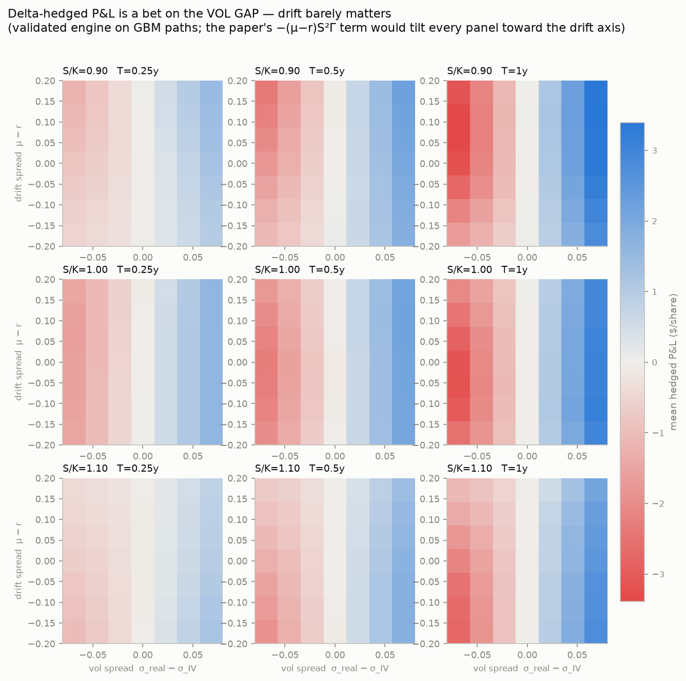
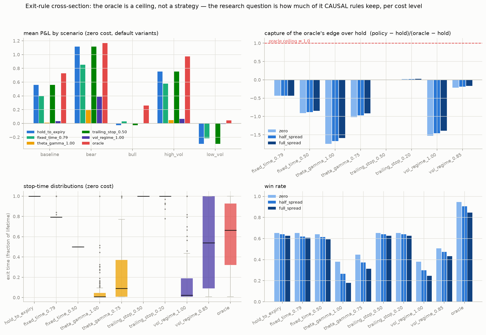
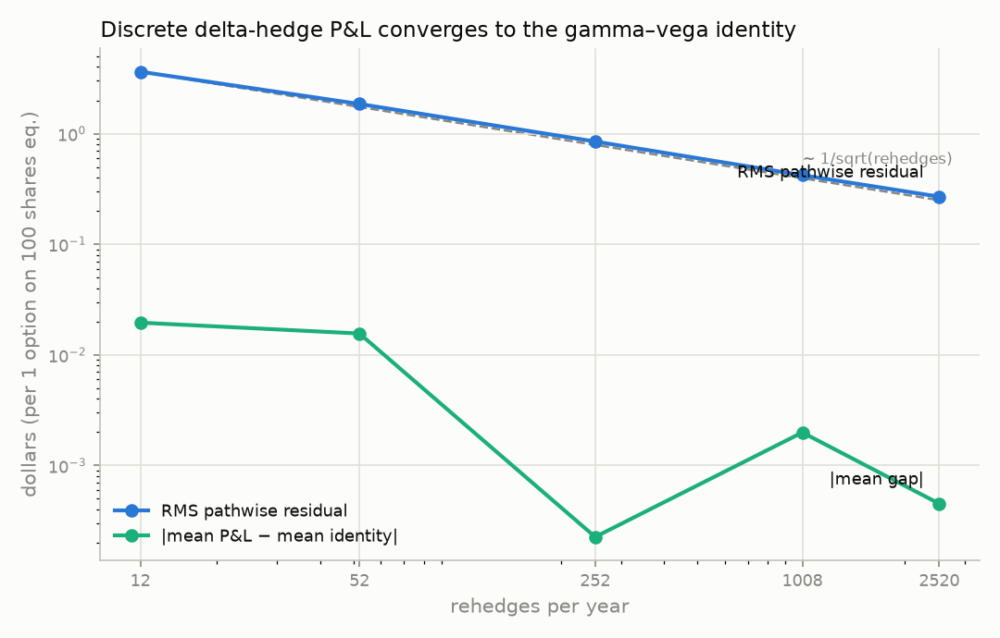

# gamma-exit

When should you close a delta-hedged long option position?

A delta-hedged long option is a bet that realized volatility will beat the
implied volatility you paid. You collect gamma P&L when the underlying moves
and you bleed theta every day it doesn't — so there's a natural stopping
problem: at some point the remaining convexity stops paying the rent.

This repo is a research backtester I built to study that trade-off properly.
It started from Ramkumar (2025), *"The Gamma Scalping–Theta Decay Trade-Off as
a Basis for American Option Valuation and Optimal Exercise Timing"* — a paper
whose framing I ended up partly disagreeing with. The engineering goal was a
pipeline where every number is defensible: no look-ahead, validated math,
transaction costs everywhere, and one command to reproduce any result.

Two things this project is careful about that the paper is not:

1. **The paper's "optimal stopping" strategy uses the future.** It exits at
   the ex-post argmax of cumulative P&L. That's an *oracle* — a useful upper
   bound, but not a strategy. Here it's quarantined in its own module,
   deliberately incompatible with the policy interface, and every tradable
   rule is scored as a *fraction of the oracle's edge* instead.
2. **The paper's derivation carries a `−(μ−r)S²Γ` drift term** that shouldn't
   survive self-financing accounting. This engine's P&L is empirically
   drift-invariant (tested at μ = r + 15% across thousands of paths), and the
   surfaces below show it: P&L moves along the vol-gap axis, not the drift
   axis.

## Results so far (synthetic worlds — real chains land next)



Every cell above is the validated engine run on GBM paths, not a formula
plot. If the paper's drift term were real, the color would tilt along the
vertical axis. It doesn't.



The headline numbers (`python scripts/headline_numbers.py` reproduces both,
seeded from the config):

- **The oracle ceiling is real but modest:** perfect-foresight exits improve
  mean P&L over hold-to-expiry by **+55%** across 300 positions in five
  regimes (+66% net of full bid-ask costs, because costs hurt holding more).
- **In constant-vol-gap worlds, causal exit rules *should* lose — and do.**
  When σ_real > σ_IV persistently, every extra day of holding has positive
  expected P&L, so all early exits give up edge (capture ≤ 0). The oracle's
  gain there is pure ex-post path selection. This is the paper's central
  claim dissolving under a causality constraint.
- **Where the edge decays mid-life, causal rules genuinely work:** in
  regime-shift scenarios (realized vol collapses halfway through), a simple
  EWMA-forecast exit rule captures **72% of the oracle's edge** (90% cluster
  bootstrap CI: 66–77%), *net of full transaction costs*.

So the honest reframing of the paper: exit timing is not free money from
convexity bookkeeping; it's a bet on volatility-regime change, and it should
be measured as one.

## Quickstart

```bash
# install (needs uv; creates ./.venv from the lockfile)
uv sync --dev
source .venv/bin/activate

# prove the math before trusting anything (~20 s)
pytest

# see the M1 gate with your own eyes: discrete hedging -> the identity
python -m gamma_exit.validation.harness

# full backtest: 5 regimes x 10 pre-registered policies x 3 cost levels
python -m gamma_exit.backtest.runner --positions-per-scenario 30

# regenerate the figures above
python -m gamma_exit.analytics.figures

# reproduce the headline numbers quoted in this README
python scripts/headline_numbers.py

# live data path (needs network; run during US market hours)
python -m gamma_exit.data.snapshot
```

Everything takes `--config` (default `configs/baseline.yaml`) — the YAML is
the single source of truth for seeds, rates, universe, quote filters, cost
levels, and the pre-registered policy grid. Code carries no copies of those
numbers, and every results artifact is written with its config and git
commit.

## How it's validated

I didn't trust the engine until it survived three gates, all in CI:

**Gate 1 — the identity.** On synthetic GBM paths, discrete delta-hedge P&L
must converge pathwise to the closed-form

```
X_T = ∫ e^{r(T−u)} · ½ Γ S² (σ_real² − σ_IV²) du
```

as rehedge frequency rises (RMS residual ~ 1/√n), with **no drift bias**, for
calls, puts, and dividend-paying underlyings:



**Gate 2 — equivalence.** The real-data replay pipeline (quote loader →
per-day IV solve → daily delta-hedge → shared accounting core) is fed a
synthetic option chain in canonical vendor format and must reproduce the
synthetic engine's P&L path to IV-solver tolerance. Real-data results
therefore inherit Gate 1; the only new thing you trust is the quotes.

**Gate 3 — system invariants.** In a fair world (μ = r, σ_real = σ_IV) no
causal policy may show significant P&L — while the oracle *must* profit from
noise, which is exactly why it's quarantined. In a world built so the vol
edge dies mid-life, the causal vol watcher *must* beat holding. The pipeline
is pinned from both sides. (One of these probes false-alarmed at n=24 during
development; the investigation that cleared it — optional stopping holds,
t = −0.02 at n=100 — is documented in the test itself.)

Pricing and Greeks are validated against QuantLib to 1e-8 or tighter, and the
whole suite (172 tests) runs from a clean `uv sync` on CI.

## Rules the code actually enforces

| Rule | Where |
|---|---|
| Hedge P&L must reconcile with the ½ΓS²(σr²−σIV²) identity | `pnl/engine.py`, `tests/test_pnl_identity.py` |
| No drift bias (the paper's μ-term rejected empirically) | `tests/test_pnl_identity.py::TestNoDriftBias` |
| Causality by construction: policies get a frozen per-day state, never a frame | `strategy/base.py`, `tests/test_no_lookahead.py` |
| The oracle is not a strategy: separate module, incompatible interface | `strategy/oracle.py` |
| Realized vol (ex-post) vs forecast vol (causal) never crossed | `vol/realized.py` vs `vol/forecast.py` |
| Every backtest runs at zero / half / full spread; all three reported | `configs/baseline.yaml`, `tests/test_cost_model.py` |
| Mid-or-drop: nothing trades on a one-sided or stale quote | `data/schema.py`, `pnl/replay.py` |
| Raw pulls are immutable; bad ones get quarantined, never deleted | `data/cache.py` |
| One time basis: trading-day years, converted only at the data boundary | `conventions.py` |
| Policy parameters pre-registered in config, never tuned on results | `configs/baseline.yaml` |

## Layout

```
src/gamma_exit/
├── conventions.py  the ONE time basis: trading-day years, 252/yr
├── config.py       typed loader for configs/*.yaml (single source of truth)
├── plotstyle.py    shared chart tokens + fixed policy colors
├── pricing/        BS price, IV solver, Greeks (QuantLib-validated)
├── pnl/            the self-financing accounting core + synthetic & replay adapters
├── vol/            realized (EX-POST ONLY) vs forecast (CAUSAL ONLY)
├── data/           canonical schema, write-once cache, yfinance provider
├── strategy/       PositionState/ExitPolicy, benchmarks, causal rules, ORACLE (quarantined)
├── backtest/       synthetic scenario source + walk-forward runner
├── analytics/      capture-fraction metrics + bootstrap CIs, regimes, figures
└── validation/     the Gate-1 reconciliation harness
tests/              172 tests incl. the three gates and system invariants
scripts/            daily snapshot job, headline-number reproduction
docs/               design notes + the figures embedded above
```

## Assumptions & limitations I know about

- **Synthetic worlds only, so far.** yfinance has no historical option
  chains, so the real-data replay is validated and waiting on a historical
  source (OptionMetrics via WRDS, or ThetaData — see `TODOS.md`). The daily
  snapshot job is already accumulating a free validation slice.
- **Same-close execution.** Decisions read the close and trade the close.
  Optimistic, but shared equally by every policy *and* the oracle, so capture
  fractions stay internally fair.
- **Stale days are marked to model** (BS at last solved IV, flagged); nothing
  trades on them, and a persistently large attribution `residual` on real
  data should be read as a data-quality alarm, not ignored.
- **Interest accrues on the trading clock** — a deliberate approximation
  worth ~1.5% *of r* on the discount exponent (sub-bp in price at r ≤ 5%).
  `conventions.py` documents when to revisit.
- **Expiry = cash settlement at that day's spot.** Real SPX monthlies are
  AM-settled; prefer PM-settled weeklies when the real data arrives.
- **Per-share units** (one option on one share). Contract multipliers and
  sizing belong to the portfolio layer, which doesn't exist yet.
- The IV solver is a plain bracketed Brent — transparent but slow. If
  full-chain recomputation ever becomes the bottleneck it gets swapped for
  Jäckel's "Let's Be Rational" (`TODOS.md`).

## References

- Ramkumar, D. (2025). *The Gamma Scalping–Theta Decay Trade-Off as a Basis
  for American Option Valuation and Optimal Exercise Timing.* (The framework
  under test here; see `docs/DESIGN.md` for what this project keeps, corrects,
  and reframes.)
- El Karoui, N., Jeanblanc-Picqué, M., & Shreve, S. (1998). *Robustness of
  the Black and Scholes formula.* — the hedging-at-the-wrong-vol identity the
  whole engine is validated against.

MIT license. If you spot an accounting error, please open an issue — the
whole point of this project is that those are findable.
